# 🎓 LearnSphere — Modern School Management & LMS Platform

<div align="center">


### 📚 Modular School Management & Learning Management System

A modern role-based LMS platform featuring gamification, notifications, analytics, attendance workflows, assignments, grades, and interactive dashboards for students, teachers, and administrators.

</div>

---

# ✨ Overview

**LearnSphere** is a modern School Management & Learning Management System (LMS) built with PHP and MySQL.

The project originally started as a traditional CRUD-based academic project, then evolved into a scalable modular educational platform featuring:

- 🎯 Role-Based Portals
- 🏆 Gamification System
- 🔔 Real-Time Notifications
- 📊 Interactive Dashboards
- 📝 Assignment & Grading Workflows
- 📅 Attendance Tracking
- 📈 Educational Analytics
- 🧠 Modular Architecture
- 🔐 Authentication & Authorization

The platform focuses heavily on:
- scalability
- maintainability
- reusable systems
- educational workflow simulation
- modern dashboard UX

---

# 🚀 Core Features

## 👨‍💼 Administrator Portal

### 🔧 Management System
- Manage students
- Manage teachers
- Manage classrooms
- Manage users
- Manage courses
- Enrollment management

### 🔐 Security & Control
- Role-Based Access Control (RBAC)
- Protected admin modules
- Centralized authentication
- Session management
- Shared validation system

### 📊 Administrative Dashboard
- Real-time metrics
- Student/teacher distribution
- System activity overview
- LMS analytics

---

## 👨‍🏫 Teacher Portal

### 📊 Classroom Intelligence Dashboard
- Attendance analytics
- Grade tracking
- Assignment monitoring
- Student performance insights
- Course statistics

### 📝 Academic Workflow System
- Create assignments
- Grade students
- Record attendance
- Track course activity
- Manage classroom operations

### 🔔 Communication System
- Send announcements
- Teacher-to-student messaging
- Notification integration
- Educational activity alerts

---

## 👨‍🎓 Student Portal

### 🎒 Interactive LMS Experience
- Personalized dashboard
- Course overview
- Assignment tracking
- Attendance history
- Grades & GPA overview
- Notifications center
- Educational activity feed

### 🏆 Gamification System
- XP system
- Achievement badges
- Student levels
- Attendance streaks
- Progress tracking
- Reward mechanics

---

# 🔔 Event-Driven Notification System

The platform contains a centralized persistent notification architecture.

Notifications are automatically generated when:

- assignments are created
- grades are submitted
- attendance is marked
- achievements are unlocked
- announcements are sent

### Features Include
- unread/read state
- notification history
- dashboard integration
- activity feed support
- reusable notification helpers
- event-driven LMS workflows

---

# 🏗️ Architecture

The project was fully refactored into a scalable modular domain-based architecture.

```text
School-Management/
│
├── assets/
│   ├── css/
│   ├── images/
│   ├── js/
│   └── screenshots/
│
├── config/
│   ├── app.php
│   ├── auth.php
│   ├── connect.php
│   ├── validation.php
│   ├── api.php
│   └── profile_sync.php
│
├── includes/
│   ├── header.php
│   ├── footer.php
│   ├── sidebar.php
│   ├── topbar.php
│   └── notifications_helper.php
│
├── modules/
│   ├── admin/
│   │   ├── students/
│   │   ├── teachers/
│   │   ├── classrooms/
│   │   ├── users/
│   │   └── courses/
│   │
│   ├── student/
│   │   ├── dashboard.php
│   │   ├── courses.php
│   │   ├── assignments.php
│   │   ├── attendance.php
│   │   ├── grades.php
│   │   ├── achievements.php
│   │   ├── messages.php
│   │   └── notifications.php
│   │
│   └── teacher/
│       ├── dashboard.php
│       ├── attendance.php
│       ├── assignments.php
│       ├── grades.php
│       ├── messages.php
│       └── announcements.php
│
├── database/
├── home.php
├── index.php
└── README.md
```

---

# ⚙️ Tech Stack

| Category | Technologies |
|---|---|
| Backend | PHP 8.x |
| Database | MySQL / MariaDB |
| Frontend | HTML5, CSS3, JavaScript |
| UI Framework | Bootstrap 5 |
| Charts & Analytics | Chart.js |
| Local Environment | XAMPP |
| Architecture | Modular Domain-Based Structure |

---

# 📊 LMS Workflows

## 📝 Assignment Workflow

```text
Teacher Creates Assignment
            ↓
Student Receives Notification
            ↓
Student Views Assignment
            ↓
Teacher Grades Submission
            ↓
Dashboard & Activity Feed Update
```

---

## 📅 Attendance Workflow

```text
Teacher Marks Attendance
            ↓
Attendance History Updates
            ↓
Student Streak Recalculated
            ↓
Gamification & Dashboard Updated
```

---

## 🏆 Achievement Workflow

```text
Student Completes LMS Activities
            ↓
XP & Progress Increase
            ↓
Achievement Unlocks
            ↓
Notification Triggered
```

---

# 🗄️ Database Design

The LMS includes a relational database architecture featuring:

- users
- students
- teachers
- classrooms
- courses
- enrollments
- assignments
- grades
- attendance
- achievements
- student_achievements
- student_xp
- notifications
- messages

---

# 🔐 Authentication & Security

- Centralized authentication system
- Shared validation layer
- Protected role-based routes
- Admin-only management modules
- Session management
- API response helpers
- Reusable auth middleware

---

# 📱 Application Preview

## 👨‍💼 Admin Dashboard

| System Overview | User Management |
|---|---|
| 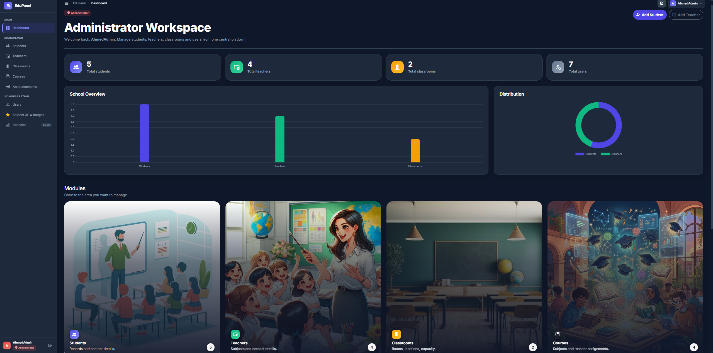 | 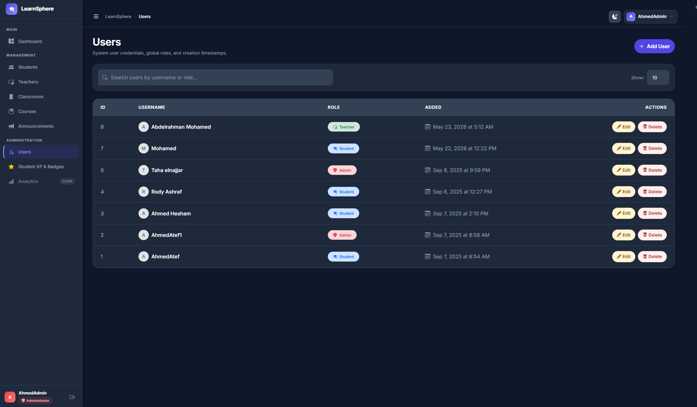 |

---

## 🎓 Student Dashboard

| Main Student Dashboard | Student Activity Feed |
|---|---|
| 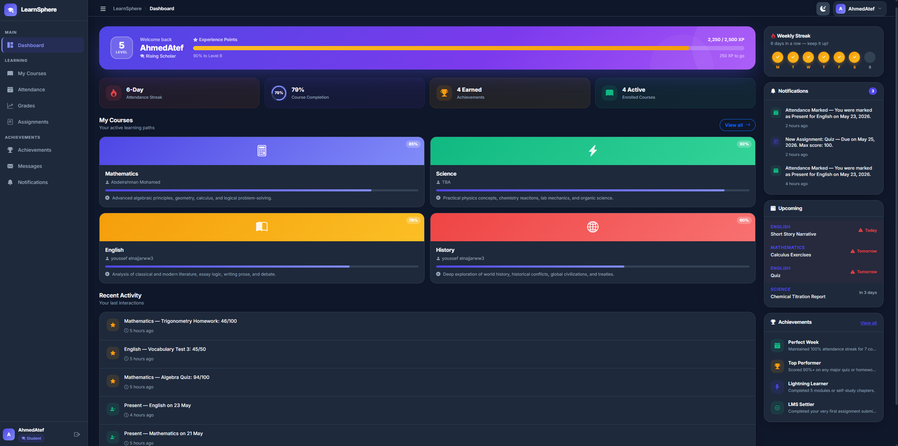 | 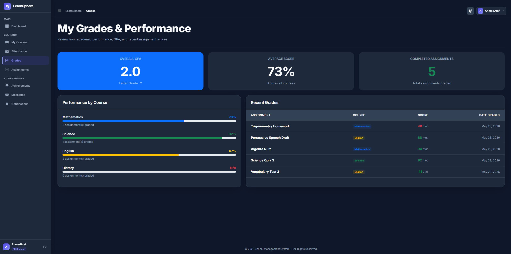 |

---

## 👨‍🏫 Teacher Dashboard

| Teacher Analytics | Classroom Management |
|---|---|
| 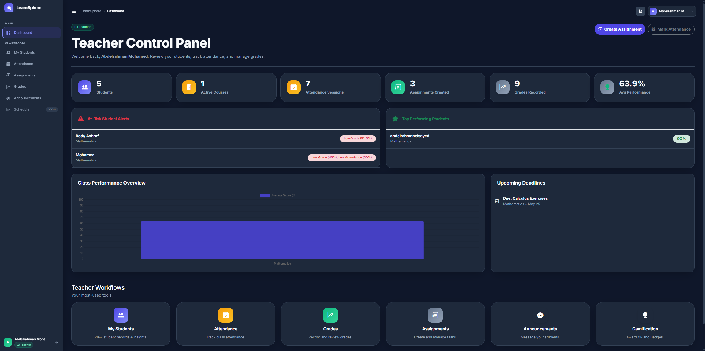 | 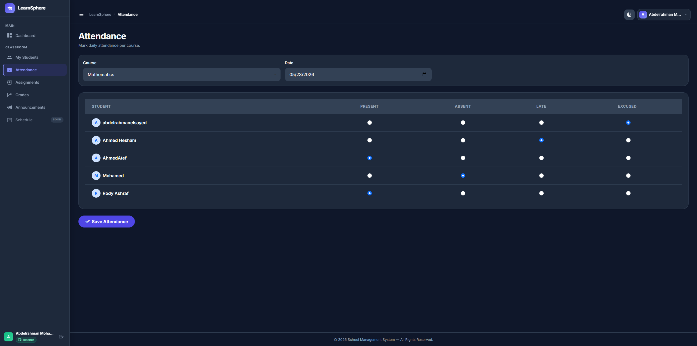 |

---

## 🏆 Gamification System

| Achievements System | XP & Levels |
|---|---|
| 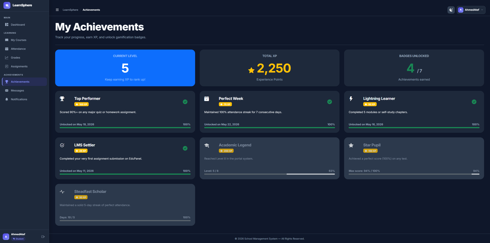 | 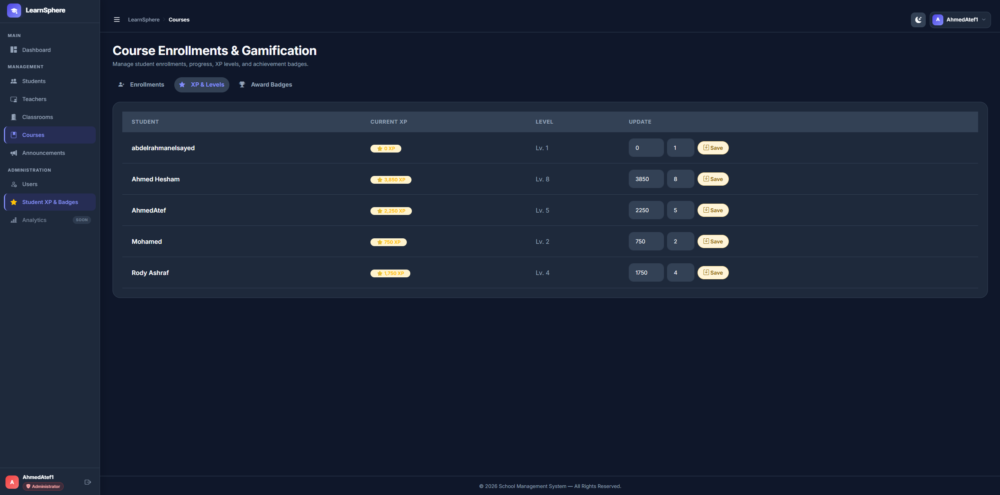 |

---

## 🔔 Notifications & Messaging

| Notifications Center | Teacher Messaging |
|---|---|
| 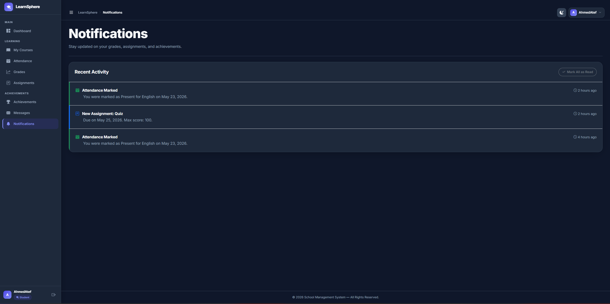 | 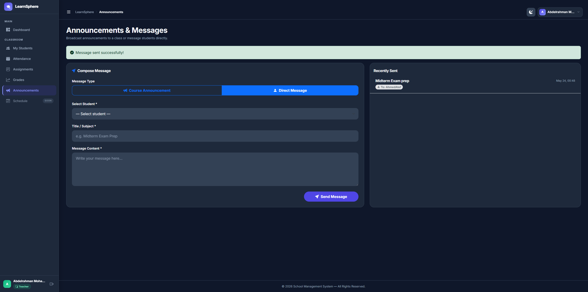 |

---

## 📅 Attendance & Grades

| Attendance Tracking | Grades Dashboard |
|---|---|
| 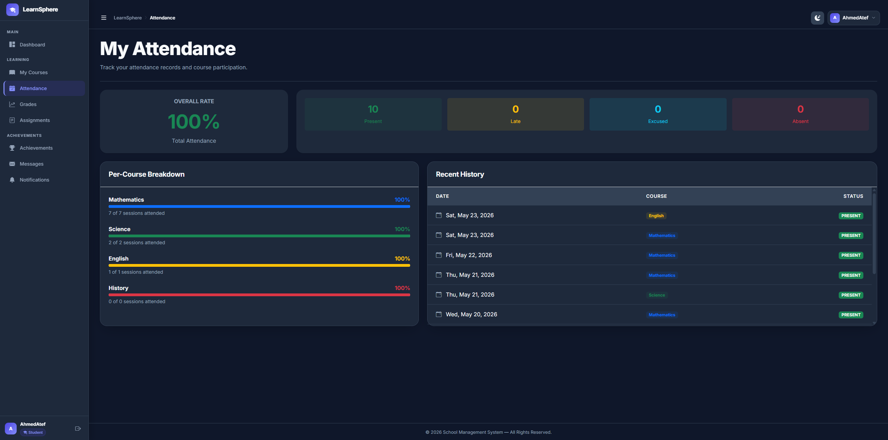 | 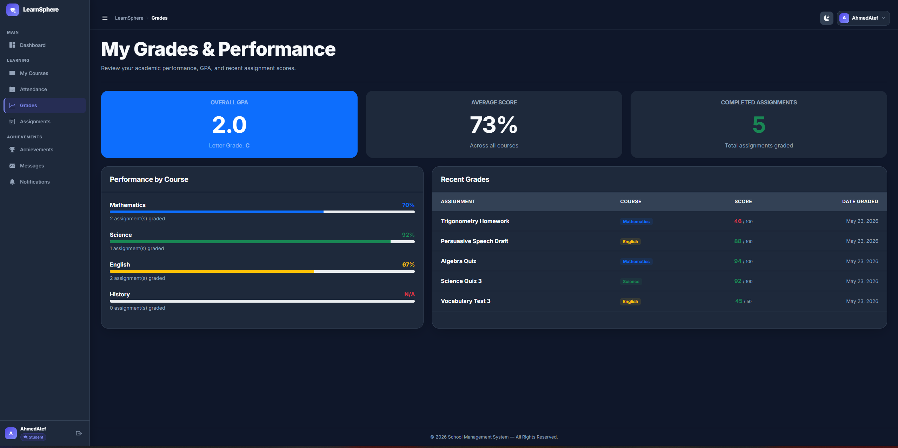 |

---

## 📝 Assignments System

| Assignments Overview | Assignment Workflow |
|---|---|
| 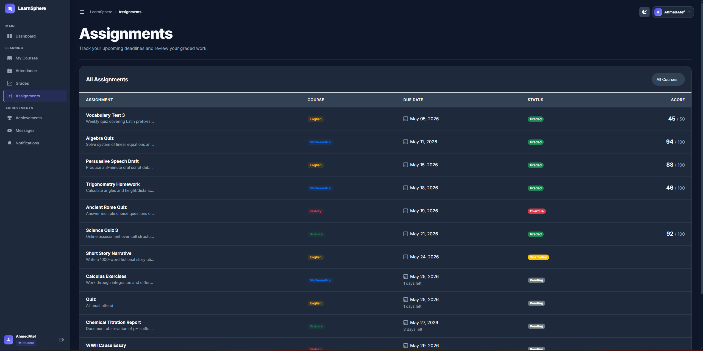 | 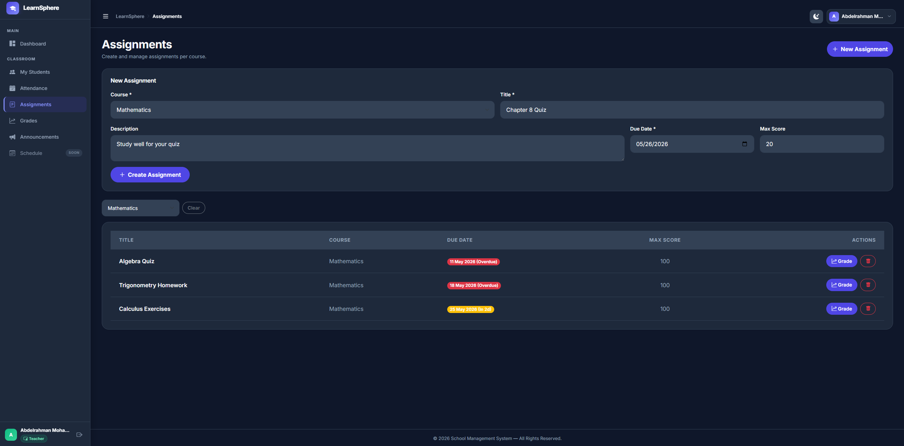 |

---

# 📂 Suggested Screenshots Folder Structure

```text
assets/screenshots/
│
├── admin_dashboard.png
├── admin_management.png
├── student_dashboard.png
├── student_activity.png
├── teacher_dashboard.png
├── classroom_management.png
├── achievements.png
├── xp_system.png
├── notifications.png
├── messages.png
├── attendance.png
├── grades.png
├── assignments.png
└── assignment_workflow.png
```

---

# ⚙️ Installation

## 1️⃣ Clone Repository

```bash
git clone https://github.com/Ahmed1Atef1/school-management-system.git
cd school-management-system
```

---

## 2️⃣ Database Setup

Create a MySQL database named:

```text
school_management
```

Then import:

```text
database/school_management.sql
```

using phpMyAdmin.

---

## 3️⃣ Configure Database Connection

Update:

```text
config/connect.php
```

with your database credentials.

---

## 4️⃣ Run Project

Using XAMPP:
- Start Apache
- Start MySQL

Then open:

```text
http://localhost/School-Management/
```

---

# 🌐 Live Demo

> 🚧 Deployment in progress...

Planned deployment options:
- InfinityFree
- Hostinger
- Railway
- Render

Future live demo link:

```text
https://learnsphere-lms-demo.com
```

---

# 🎯 Future Improvements

Planned future enhancements:

- Assignment submission system
- File upload workflows
- Real-time chat system
- WebSocket notifications
- AI-powered analytics
- Calendar & scheduling system
- Mobile optimization
- REST API expansion
- Dark/light theme enhancements

---

# 📚 Engineering Concepts Demonstrated

This project demonstrates:

- Modular Architecture
- Role-Based Systems
- LMS Workflow Design
- Relational Database Modeling
- Event-Driven Notifications
- Gamification Systems
- Dashboard UX Design
- Authentication & Authorization
- Reusable Component Design
- Scalable Project Refactoring

---

# 👨‍💻 Developer

## Ahmed Atef

Business Information Systems (BIS) Student

- GitHub: https://github.com/Ahmed1Atef1
- LinkedIn: https://www.linkedin.com/in/ahmed-atef-15f234/

---

<div align="center">

### 🎓 LearnSphere — Modern Educational Platform Prototype

Built with PHP, MySQL, Bootstrap, JavaScript & Modular Architecture

⭐ If you like the project, consider starring the repository.

</div>