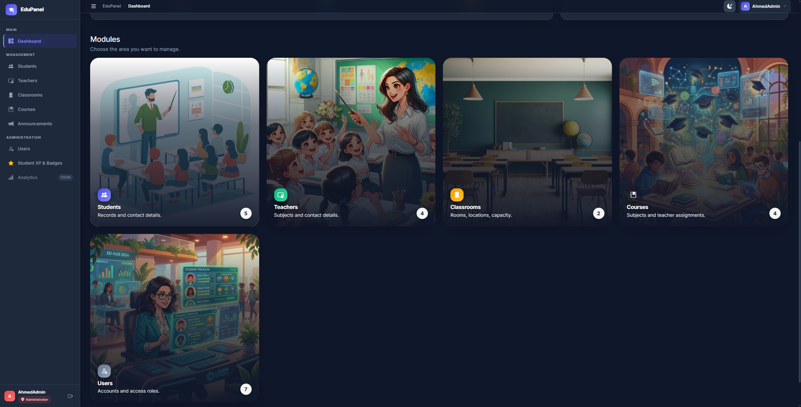

# 🎓 LearnSphere: Modern School Management System



Welcome to **LearnSphere** — a sleek, high-performance, and modular Learning Management System (LMS) built with modern PHP, vanilla JavaScript, and robust SQL architecture.

LearnSphere is designed to bridge the gap between administrators, teachers, and students through a beautiful, gamified, and highly intuitive user interface.

## 🚀 Key Features

### 👨‍💼 Administrator Portal
- **Modular CRUD Ecosystem:** Clean, isolated namespaces for managing Students, Teachers, Classrooms, Courses, and Users.
- **Visual Analytics:** Real-time metrics powered by Chart.js for enrollment trends and distribution.
- **Access Control:** Secure Role-Based Access Control (RBAC) ensuring precise permissions across the entire app.

### 👩‍🏫 Classroom Intelligence (Teacher Portal)
- **Live Roster Tracking:** View enrolled students and monitor real-time attendance.
- **Assignment & Grading Hub:** Seamlessly create assignments, track submissions, and dispatch grades.
- **Automated Alerts:** Identify at-risk students who are falling behind on attendance or coursework.

### 🎒 Gamified Student Experience
- **Interactive Dashboards:** A rich, immersive portal tailored specifically for the student experience.
- **Live Notifications:** Stay updated with instant alerts for new assignments and grades.
- **XP & Badges System:** Earn experience points and unlock custom achievements for academic excellence and perfect attendance.

## 🛠️ Architecture & Tech Stack

This project strictly adheres to a domain-driven architectural pattern to ensure scalability and maintainability:

*   **Backend:** Modern PHP 8.x (Object-Oriented & Procedural blend)
*   **Database:** MySQL / MariaDB
*   **Frontend:** HTML5, CSS3 (Custom Design System with Light/Dark Mode), Bootstrap 5, Vanilla JS
*   **Data Visualization:** Chart.js

### Directory Structure
```text
/config        # Core database connections, auth helpers, and global utilities
/database      # SQL schema blueprints and seed data
/assets        # Custom CSS, JS, and high-quality generated UI illustrations
/includes      # Reusable frontend partials (Header, Sidebar, Topbar)
/modules       # The Core Application Logic
  ├── /admin   # Management CRUD (Users, Students, Teachers, etc.)
  ├── /student # The Student Experience (Gamification, Assignments)
  └── /teacher # The Teacher Dashboard (Grading, Analytics)
```

## ⚙️ Quick Start Installation

1.  **Clone the Repository**
    ```bash
    git clone https://github.com/Ahmed1Atef1/school-management-system.git
    cd school-management-system
    ```
2.  **Database Setup**
    *   Create a new MySQL database named `school_management`.
    *   Import the highly optimized schema provided in `/database/school_management.sql`.
3.  **Environment Configuration**
    *   If necessary, update your database credentials inside `/config/connect.php` (defaults to local XAMPP `root` with no password).
4.  **Run the Server**
    *   Host the project directory using XAMPP, WAMP, or Laravel Valet.
    *   Navigate to `http://localhost/School-Management` (or your configured local domain) and log in!

## 🔐 Default Local Roles (Seed Data)
The provided `.sql` file comes fully seeded with demo data:
*   **Admin:** `ahmedadmin@gmail.com`
*   **Teacher:** `moha@gmail.com`
*   **Student:** `ahmed@gmail.com`

---

*Designed and developed by Ahmed Atef.*
